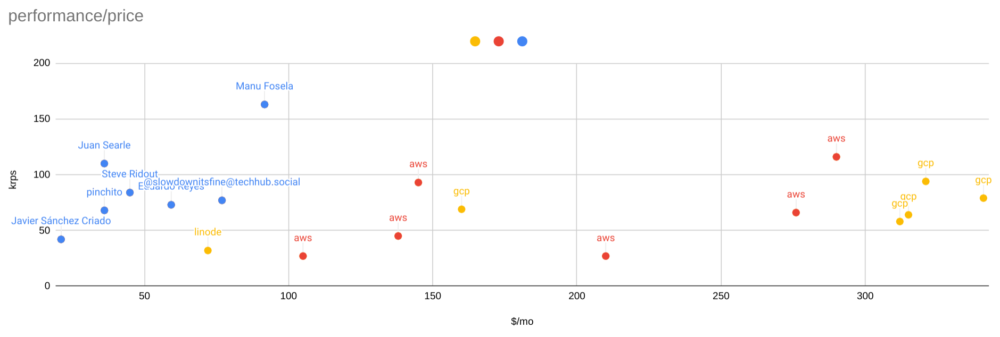

# Cloud Performance

Performance on the cloud can be disappointing.
Be sure to benchmark and compare your cloud instances.



## Installation

Ubuntu 22.04 LTS:

```shell
$ lsb_release -a
No LSB modules are available.
Distributor ID:	Ubuntu
Description:	Ubuntu 22.04.3 LTS
Release:	22.04
Codename:	jammy
```

Instructions on [nodesource](https://github.com/nodesource/distributions).

```
sudo apt install nodejs
```

Download repo and run benchmark:

```shell
$ git clone https://github.com/alexfernandez/loadtest
$ cd loadtest
$ npm install
$ node bin/tcp-performance.js
```

## Benchmarks

We will see a synthetic benchmark using bare iron,
and on some cloud providers.
The benchmark [`bin/tcp-performance.js`](https://github.com/alexfernandez/loadtest/blob/main/bin/tcp-performance.js)
starts the server on half the cores (max three), and then runs the loadtest on just one core,
to ensure that the servers can take the load.
It is (as its name implies) using bare sockets, as in the `--tcp` mode.

Result is best of three (if available), rounded to the nearest krps.
All results tabulated on
[Google Sheets](https://docs.google.com/spreadsheets/d/1_33mTCCVnKdBZf6ZZaDCbmd2ZcVzpwgIdS0RV3Nh1e8/edit?usp=sharing)
by price and performance,
estimating a typical laptop with three years of useful life.

### Bare Iron

I asked on Mastodon, Twitter and Meetup for contributions using different processors.

First my own cirrus7, with an Intel Core processor: i5-12400T. Result: **69 krps**.

```
Effective rps:       68391
Effective rps:       69082
Effective rps:       68044
```

Next a laptop with a processor: Intel Core i7-9750H (courtesy of Javier Sánchez Criado).
Result: **42 krps**, weakest of the bunch.

```
Effective rps:       31878
[...]
Effective rps:       42439
```

Note: after the first test (32 krps) I realized that my benchmark had started the server on 6 cores,
when the processor actually has just 6 cores -- they turn to 12 using hyperthreading.
Therefore all 6 cores were busy with the server, and the `loadtest` process had to 
So I tuned the test server to start 3 cores max and Javier was nice enough to re-run it,
helping the result reach 42 krps.

Finally a Dell laptop using a processor: Intel Core i9-12900HK (courtesy of Manu Fosela).
Result: **162 krps**, absolute record.

```
Effective rps:       162517
```

Now we turn to the Apple side with a MacBook Pro 2021, sporting an Apple processor: M1 Pro (courtesy of Eduardo Reyes).
Result: **74 krps**.

```
Effective rps:       64271
Effective rps:       73554
Effective rps:       73486
```

Note: execution improved over several iterations.

Another Mac, processor: Apple M1 Max (courtesy of @slowdownitsfine@techhub.social). Result: **77 krps**.

```
Effective rps:       77497
```

Procesador: Apple M1 Pro (courtesy of Steve Ridout). Result: **84 krps**.

```
Effective rps:       84219
```

A Macbook Air 2023, processor: Apple M2 (courtesy of Juan Searle).
Result: **110 krps**, best of the Apple bunch.

```
Effective rps:       109672
```

### AWS

Again Ubuntu 22.04 LTS.
Using 4 or even better 8 CPUs (i.e. cores) whenever possible
so the test server runs on several,
but remember that performance for `loadtest` is single-core.

Shared tenancy, `c5-xlarge` (4 CPUs) $138/mo.
Processor: Intel(R) Xeon(R) Platinum 8275CL CPU @ 3.00GHz.
Result: **45 krps**.

```
$ node bin/tcp-performance.js
Effective rps:       40597
Effective rps:       43169
Effective rps:       44708
```

Shared tenancy, `c5d-2xlarge` (8 CPUs) $276/mo.
Processor: Intel(R) Xeon(R) Platinum 8275CL CPU @ 3.00GHz.
Result: **66 krps**.

```
Effective rps:       66297
Effective rps:       66282
Effective rps:       65697
```

`c7i.xlarge` (4 CPUs): $145/mo.
Processor: Intel(R) Xeon(R) Platinum 8488C.
Result: **93 krps**.

```
Effective rps:       87724
Effective rps:       92516
Effective rps:       91890
```

`c7i.2xlarge` (8 CPUs): $290/mo.
Processor: Intel(R) Xeon(R) Platinum 8488C.
Result: **117 krps**, best of all clouds.

```
Effective rps:       113440
Effective rps:       110351
Effective rps:       116512
```

`c6g.xlarge` (4 CPUs) $105/mo. This one is interesting because it uses the arm64 architecture, advertised as "best cost-effectiveness".
Processor: ARM Neoverse-N1.
Result: **27 krps**, very disappointing.

```
Effective rps:       26747
Effective rps:       27430
Effective rps:       26680
```

`c6g.2xlarge` (4 CPUs) $210/mo, again using the arm64 architecture.
Processor: ARM Neoverse-N1.
Result: **28 krps**, again very disappointing.

```
Effective rps:       27557
Effective rps:       27639
Effective rps:       27727
```

### Linode

Dedicated 8 GB, $72/mo, 4 CPUs.
Processor: AMD EPYC 7713 64-Core Processor.
Result: **33 krps**, also very disappointing.

```
Effective rps:       29100
Effective rps:       31635
Effective rps:       32524
Effective rps:       32043
```

### Google Cloud

C2 (8 CPUs) $315/mo "ultra-high performance".
Processor: Intel(R) Xeon(R) CPU @ 3.10GHz.
Result: **64 krps**, not so ultra-high.

```
Effective rps:       64008
Effective rps:       62939
Effective rps:       63274
```

C2D: c2d-standard-8 $341/mo.
Processor: AMD EPYC 7B13.
Result: **79 krps**.

```
Effective rps:       76673
Effective rps:       79157
Effective rps:       73479
```

C3: c3-standard-8 $321/mo "consistently high performance"
Processor: Intel(R) Xeon(R) Platinum 8481C CPU @ 2.70GHz.
Result: **94 krps**, best of GCP.

```
Effective rps:       92161
Effective rps:       94349
Effective rps:       94015
```

C3: c3-standard-4 $160/mo
Processor: Intel(R) Xeon(R) Platinum 8481C CPU @ 2.70GHz

```
Effective rps:       69463
Effective rps:       68472
Effective rps:       69188
```

N2: n2-standard-8 $312/mo "balanced price and performance"
Processor: Intel(R) Xeon(R) CPU @ 2.80GHz

```
Effective rps:       55098
Effective rps:       58464
Effective rps:       55662
```

### bun.sh

The new supposedly fast JS server framework, testing against a local nginx.
Cluster mode is not working yet, so cannot use the usual script `bin/tcp-performance.js`;
comparisons are using just one core to be fair.

```
bun bin/loadtest.js http://localhost:80/ --cores 1 -k
Effective rps:       14401
```

For comparison:

```
node bin/loadtest.js http://localhost:80/ --cores 1 -k
Effective rps:       18799
```

TCP mode was broken, after a [quick fix](https://github.com/alexfernandez/loadtest/commit/059423e0f5831d6bd63d33c600ab1ee3042af1a2):

```
bun bin/loadtest.js http://localhost:80/ --cores 1 -k --tcp
Effective rps:       62517
```

For comparison:

```
node bin/loadtest.js http://localhost:80/ --cores 1 -k --tcp
Effective rps:       60231
```

bun.sh is a bit faster using plain TCP sockets!
But a bit slower using `http` mode.

## Other Options

Another useful benchmark: [performance](https://www.npmjs.com/package/performance),
specifically geared towards performance.

## Conclusions

Apple processors are not as performant as they are made to be:
a good Intel Core laptop i9 blows them out of the water.
Truth be told, I don't have results for M2 Max, M2 Pro or M2 Ultra
(hint, hint).

Cloud providers are sluggish at best, super expensive at worst.
Be sure to benchmark your intended instances as they can be charging > $300/mo
for a bunch of cores you will not be using,
or that will perform worse than you think.

If necessary, create your own synthetic benchmark,
`loadtest` can be of help here using its [powerful API](./api.md).

